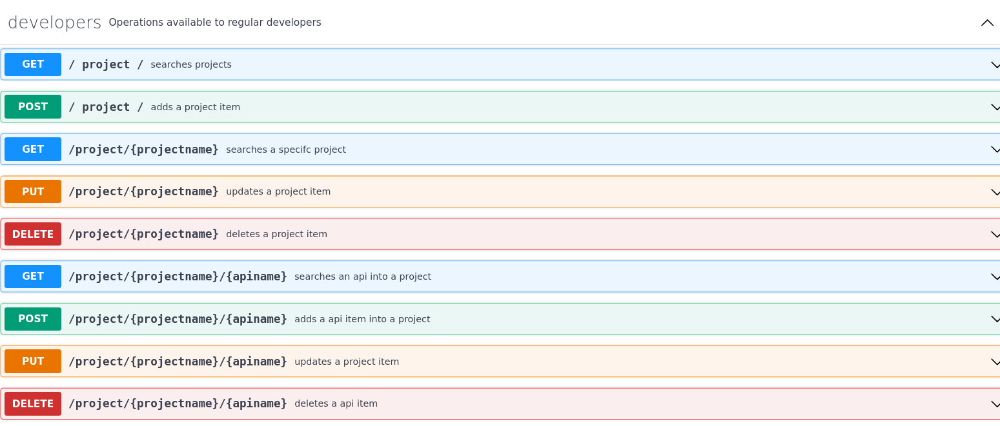

# desafioATL

## Go API Server for API Inventory

**Objetivo**

centralizar o cadastro de todas as APIs
desenvolvidas por todos os projetos da organização de modo que tais APIs possam ser
descobertas e utilizadas pelos diversos times.

- API version: 1.0.0

### Modelo


## Artefatos importantes

### openApi Specification

- API version: 1.0.0
[API SPec](./api/swagger.yalm)




### Orquestração de containers

**Persistência de Dados**

A persistência de dados escolhida foi o mongoDb


**Observação importante 1**

O MVP da api foi inicialmente configurado  para o serviço mongoDb Atlas, visando atingir o requisito bonus de deixa a api rodando em um servidor gratuito.

Conforme foram surgindo problemas técnicos com o gerenciamento de pacotes da golang(ver observação 2),decidi por fazer uma  estrutura de dados em memória, permitindo o teste funcional básico da api. 

**Observação importante 2**

Devido a problemas de gestão de módulos da Golang e contexto de permissão de geração de imagem do Docker,não foi possível gerar a imagem do servidor de API.

No entanto,apresento abaixo os artefatos sugeridos pela comunidade como suficientes (embora no caso do desafio não tenha funcionado)

[DockerFile](./docker/Dockerfile)

[DockerComposeFile](./docker/api_compose)


### Testes da Api

O teste unitário foi criado com a Biblioteca Testfy 

O artefato de de Teste unitário é o: [Unit Test File](./APITest.go)

Caso a api tivesse sido abrigada em um host na nuvem, seria possível fazer testes com: ![external test]https://www.datadoghq.com/dg/apm/synthetics/api-test/

### Running the server
Para rodar o servidor de API basta:

```
go run .
```

