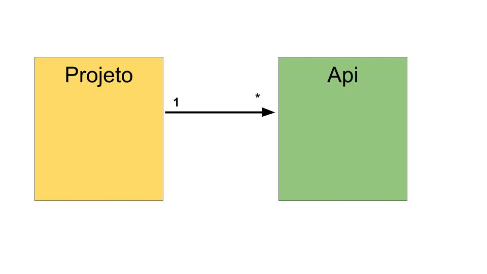
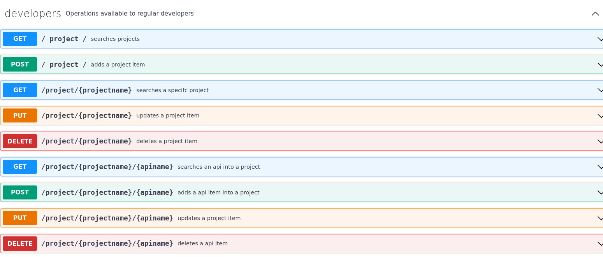

# desafioATL

## Go API Server for API Inventory

**Objetivo**

centralizar o cadastro de todas as APIs
desenvolvidas por todos os projetos da organização de modo que tais APIs possam ser
descobertas e utilizadas pelos diversos times.

- API version: 1.0.0

## Modelo



## Artefatos importantes
**openApi Specification**

- API version: 1.0.0
[API SPec](./api/swagger.yalm)




### Running the server
Para rodar o servidor de API basta:

```
go run .
```

